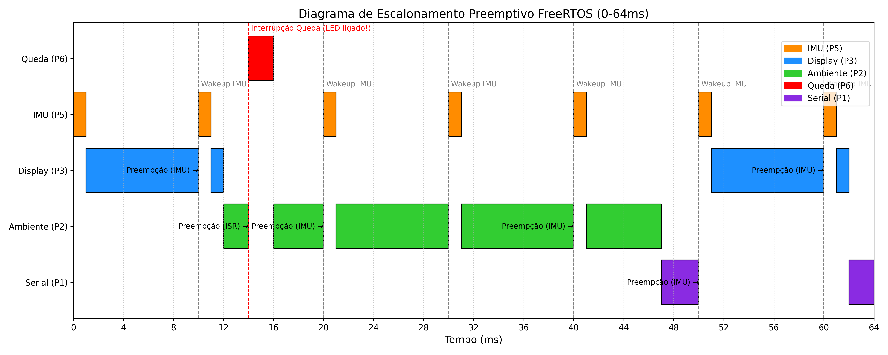

# ESP32-S2 Embedded Systems Project

This repository contains an embedded systems project built for the ESP32-S2 Mini using the ESP-IDF framework and FreeRTOS. The project interfaces with various sensors including an MPU6050 IMU, DHT11 Temperature/Humidity sensor, a Photoresistor (LDR), and an SSD1306 OLED display. 

The project highlights the critical differences between a standard sequential "super-loop" architecture and a Real-Time Operating System (RTOS) approach using FreeRTOS for preemptive multitasking, hardware interrupts, and thread-safe data handling.

## FreeRTOS Task Scheduling

Below is the Gantt chart illustrating the preemptive scheduling of the FreeRTOS tasks. It demonstrates how high-priority tasks like the IMU and Hardware Interrupts (Fall Detection) preempt lower-priority tasks (Display, Environment, Serial).



## Repository File Structure

Here is a detailed explanation of what every file in this repository does:

### Root Directory
* **`gantt_freertos.png`**: The Gantt chart image shown above. It provides a visual representation of the FreeRTOS preemptive task scheduling over time.
* **`gantt_graph.py`**: A Python script that uses `matplotlib` to programmatically generate the `gantt_freertos.png` scheduling diagram.
* **`plot_data.py`**: A real-time data visualization Python script. It automatically finds the ESP32-S2 serial port, reads incoming IMU path/dead-reckoning data, and dynamically plots it on a graph.
* **`pin_connect.md`**: A comprehensive and detailed hardware wiring guide. It explains exactly how to safely connect the OLED, MPU6050 IMU, DHT11, LDR, LED, and push button to the ESP32-S2 Mini.
* **`CMakeLists.txt`**: The top-level CMake build configuration file required by the ESP-IDF framework to compile the project.
* **`sdkconfig`** / **`sdkconfig.old`**: Project configuration files generated by ESP-IDF, defining the hardware, component, and RTOS settings.
* **`dependencies.lock`**: The ESP-IDF component manager lock file, ensuring reproducible builds with the correct dependency versions.

### `main` Directory (Source Code)
* **`main/realtime.c`**: The primary FreeRTOS implementation. This firmware spawns separate tasks with explicit priorities (e.g., IMU at highest priority, Serial at lowest). It utilizes Mutexes for thread-safe environment data sharing and Hardware Interrupts with Semaphores for immediate fall detection, ensuring the IMU loop runs consistently at 100Hz without being blocked by slower sensors.
* **`main/mainloop.c`**: An alternative, naive "super-loop" implementation. This code runs all sensor reads and screen updates sequentially in a single loop. It serves as a demonstration of why a super-loop is flawed for real-time systems, as slow blocking functions (like the DHT11 reads) cause the system to miss critical IMU data.
* **`main/test_hardware.c`**: A hardware diagnostic and calibration program. It provides a simple routine to test basic GPIO connections, verify the I2C bus, draw test patterns on the OLED, and run a calibration sequence to find offsets for the MPU6050 IMU.
* **`main/utils.c`**: The core utility implementation file. It contains all the low-level hardware abstraction logic, including I2C scanner/initialization, IMU math (dead reckoning), DHT11 data parsing, analog light reading, and OLED drawing functions.
* **`main/utils.h`**: The header file for `utils.c`. It defines all hardware pin macros (I2C pins, IMU interrupt pin, DHT11 pin), configuration flags (like enabling a virtual IMU), and exposes the utility function prototypes.
* **`main/CMakeLists.txt`**: The component-level CMake file instructing ESP-IDF on which source files to compile for the main application.

## Getting Started
To compile and flash the project, you can use the standard ESP-IDF commands. Make sure you set your desired source file (`realtime.c`, `mainloop.c`, or `test_hardware.c`) as the entry point in your build system, then run:

```bash
idf.py build
idf.py flash monitor
```
