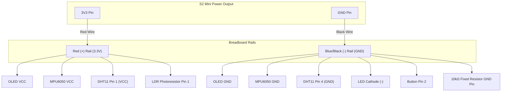
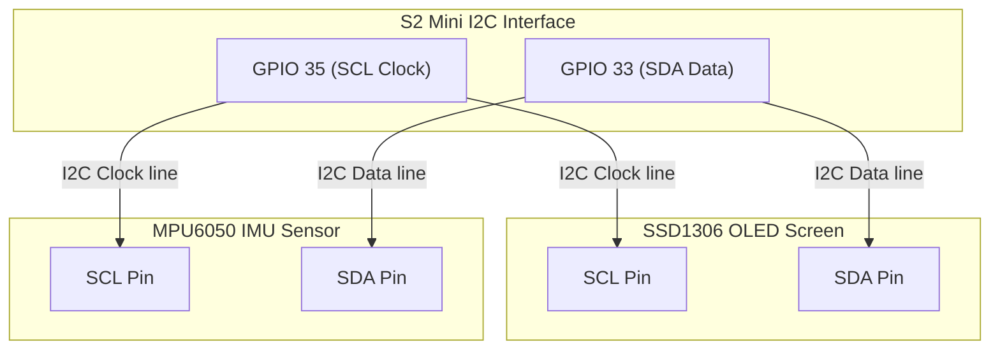
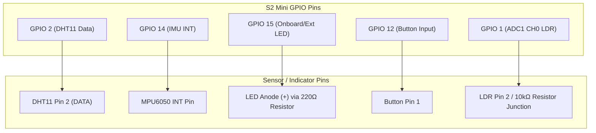

# ESP32-S2 Mini Pin Connections & Safety Wiring Guide

This document lists the exact physical wiring connections for your Wemos/LOLIN **ESP32-S2 Mini** board and sensors. 

> [!WARNING]
> **READ CAREFULLY BEFORE POWERING ON!**
> Wiring errors can permanently damage (burn) your ESP32-S2 or sensors. Follow the safety tips and wire-by-wire checklists below.
> 
> * **Never connect 5V (VBUS) to the 3.3V pins of sensors** unless they are explicitly rated for it.
> * **Always use current-limiting resistors** for the LED and LDR as specified below.
> * **Do not let bare wires or resistor legs touch each other**, as this causes short circuits.

---

## Part 1: Step-by-Step Wiring Checklist

Follow this checklist wire-by-wire to connect your components safely to your S2 Mini.

### 1. Power & Ground Distribution (Breadboard Rails)
Since multiple components need **3.3V** and **GND**, it is best to use your breadboard power rails:
* [ ] Run a wire from the **S2 Mini 3V3 Pin** to the **Red (+) Breadboard Rail**. (This is your 3.3V power source).
* [ ] Run a wire from the **S2 Mini GND Pin** to the **Blue/Black (-) Breadboard Rail**. (This is your Ground source).

---

### 2. SSD1306 OLED Display (4 pins)
* [ ] Connect **OLED VCC** to the **Red (+) Breadboard Rail (3.3V)**.
* [ ] Connect **OLED GND** to the **Blue/Black (-) Breadboard Rail (GND)**.
* [ ] Connect **OLED SCL** to **S2 Mini Pin 35 (SCL)**.
* [ ] Connect **OLED SDA** to **S2 Mini Pin 33 (SDA)**.

---

### 3. MPU6050 IMU Module (8 pins - only 5 used)
* [ ] Connect **MPU6050 VCC** to the **Red (+) Breadboard Rail (3.3V)**. *(Warning: Do NOT connect to 5V!)*
* [ ] Connect **MPU6050 GND** to the **Blue/Black (-) Breadboard Rail (GND)**.
* [ ] Connect **MPU6050 SCL** to **S2 Mini Pin 35 (SCL)**.
* [ ] Connect **MPU6050 SDA** to **S2 Mini Pin 33 (SDA)**.
* [ ] Connect **MPU6050 INT** to **S2 Mini Pin 14**.
* *Leave AD0, XDA, and XCL pins empty and unconnected.*

---

### 4. Photoresistor (LDR) Analog Light Sensor
*Requires a **voltage divider** circuit to read analog changes and protect the pins.*
* [ ] Connect **Leg 1** of the Photoresistor to the **Red (+) Breadboard Rail (3.3V)**.
* [ ] Connect **Leg 2** of the Photoresistor directly to **S2 Mini Pin 1 (ADC1 CH0)**.
* [ ] Connect a physical **$10\text{k}\Omega$ fixed resistor** (Brown-Black-Orange-Gold bands) between **S2 Mini Pin 1** (where Leg 2 of the LDR is connected) and the **Blue/Black (-) Breadboard Rail (GND)**.
* > [!CAUTION]
  > **DO NOT** connect the photoresistor directly between 3.3V and GND without the $10\text{k}\Omega$ resistor! This will cause a short circuit when exposed to bright light and can burn the S2 Mini pin.

---

### 5. DHT11 Temperature & Humidity Sensor
Determine if your sensor is a **3-pin module** or a **bare 4-pin sensor**:

#### Option A: If using a 3-pin module (mounted on a small PCB)
* [ ] Connect **Module VCC (+)** to the **Red (+) Breadboard Rail (3.3V)**.
* [ ] Connect **Module GND (-)** to the **Blue/Black (-) Breadboard Rail (GND)**.
* [ ] Connect **Module DATA (OUT/S)** directly to **S2 Mini Pin 2**.
* *(Note: Modules have an onboard resistor; you do not need an external one).*

#### Option B: If using a bare 4-pin sensor (blue plastic grid casing)
* [ ] Connect **Pin 1 (VCC)** to the **Red (+) Breadboard Rail (3.3V)**.
* [ ] Connect **Pin 2 (DATA)** directly to **S2 Mini Pin 2**.
* *Leave Pin 3 unconnected.*
* [ ] Connect **Pin 4 (GND)** to the **Blue/Black (-) Breadboard Rail (GND)**.
* [ ] Place a physical **$4.7\text{k}\Omega$ or $10\text{k}\Omega$ resistor** between **Pin 1 (3.3V)** and **Pin 2 (DATA)** of the sensor.

---

### 6. Indicator LED
*Requires a resistor to limit current and prevent burning the LED or the GPIO pin.*
* [ ] Connect **S2 Mini Pin 15** (which also drives the onboard LED) to one end of a **$220\Omega$ or $330\Omega$ resistor** (Red-Red-Brown-Gold or Orange-Orange-Brown-Gold).
* [ ] Connect the other end of the resistor to the **Long Leg (+) Anode** of the LED.
* [ ] Connect the **Short Leg (-) Cathode** of the LED to the **Blue/Black (-) Breadboard Rail (GND)**.
* > [!TIP]
  > Because **Pin 15** is connected to the S2 Mini's built-in onboard LED, the onboard LED will blink automatically in sync with your external LED!
* > [!CAUTION]
  > **DO NOT** connect the LED directly to Pin 15 without a resistor! It will draw too much current and burn the pin or the LED.

---

### 7. Push Button
* [ ] Connect **Pin 1** of the button to **S2 Mini Pin 12**.
* [ ] Connect **Pin 2** of the button to the **Blue/Black (-) Breadboard Rail (GND)**.
* *(Note: The code configures the S2 Mini's internal pull-up resistor on Pin 12, so no external resistor is required).*

---

## Part 2: Wiring Diagrams (Split by Function)

### Diagram A: Power & Ground Distribution (3.3V & GND Rails)
Use this diagram to connect the power and ground connections of all your devices to the breadboard rails.

---

### Diagram B: Shared I2C Communication Bus (OLED & IMU)
Both the OLED display and the MPU6050 IMU sensor share the exact same I2C SDA and SCL pins on the S2 Mini.

---

### Diagram C: Dedicated GPIO Pin Connections (LED, Button, LDR, DHT11)
These components connect directly to their own dedicated GPIO pins on the S2 Mini.

---

## Part 3: Quick Reference Table

| Component | Pin Name | Connects To | Safety Warning |
| :--- | :--- | :--- | :--- |
| **OLED** | VCC | 3.3V Rail | **Must be 3.3V.** |
| | GND | GND Rail | Connect directly. |
| | SCL | GPIO 35 | Connect directly. |
| | SDA | GPIO 33 | Connect directly. |
| **MPU6050 IMU** | VCC | 3.3V Rail | **Must be 3.3V. Do not connect to 5V.** |
| | GND | GND Rail | Connect directly. |
| | SCL | GPIO 35 | Connect directly. |
| | SDA | GPIO 33 | Connect directly. |
| | INT | GPIO 14 | Connect directly. |
| **Photoresistor (LDR)** | Pin 1 | 3.3V Rail | Connect directly to 3.3V. |
| | Pin 2 | GPIO 1 | **Must connect to GPIO 1 AND GND via a $10\text{k}\Omega$ resistor.** |
| **DHT11 Sensor** | Pin 1 (VCC) | 3.3V Rail | Connect directly. |
| | Pin 2 (DATA) | GPIO 2 | **Requires a physical $4.7\text{k}\Omega - 10\text{k}\Omega$ pull-up to 3.3V** (if bare sensor). |
| | Pin 4 (GND) | GND Rail | Connect directly. |
| **LED** | Anode (+) | GPIO 15 | **Must connect in series with a $220\Omega - 330\Omega$ resistor.** |
| | Cathode (-) | GND Rail | Connect directly. |
| **Push Button** | Pin 1 | GPIO 12 | Connect directly. |
| | Pin 2 | GND Rail | Connect directly. |

---

## Part 4: Safety Rules for Using an External Power Supply

If you choose to use an **external 3.3V power supply** (instead of powering everything from the S2 Mini's 3.3V pin), you must strictly follow these rules to avoid short circuits and frying your components:

### 1. Connect Common Grounds (GND)
* **Rule**: You **MUST** connect the Ground (GND) of your external power supply to the Ground (GND) of the S2 Mini.
* **Why**: Electricity needs a return path. If the grounds are not connected, the communication signals (I2C SDA/SCL, GPIOs) will have no reference point, and the sensors will not work or will send corrupt data.

### 2. Never Connect Two 3.3V Output Pins Together
* **Rule**: **NEVER** connect the S2 Mini's `3V3` pin to the `3.3V` output pin of your external power supply. 
* **Why**: Two regulators will "fight" to maintain 3.3V. Even a tiny voltage difference (e.g. 3.29V vs 3.31V) will cause massive current to flow back and forth between them, which will quickly overheat and destroy the regulators on both the S2 Mini and your power supply.

### 3. Wiring Example if using External 3.3V:
* External Supply `3.3V` $\rightarrow$ Connect to **IMU VCC**, **OLED VCC**, **DHT11 VCC**, **LDR Pin 1**.
* External Supply `GND` $\rightarrow$ Connect to **S2 Mini GND** AND all sensor grounds.
* S2 Mini `3V3` $\rightarrow$ **Leave completely disconnected (empty).**
